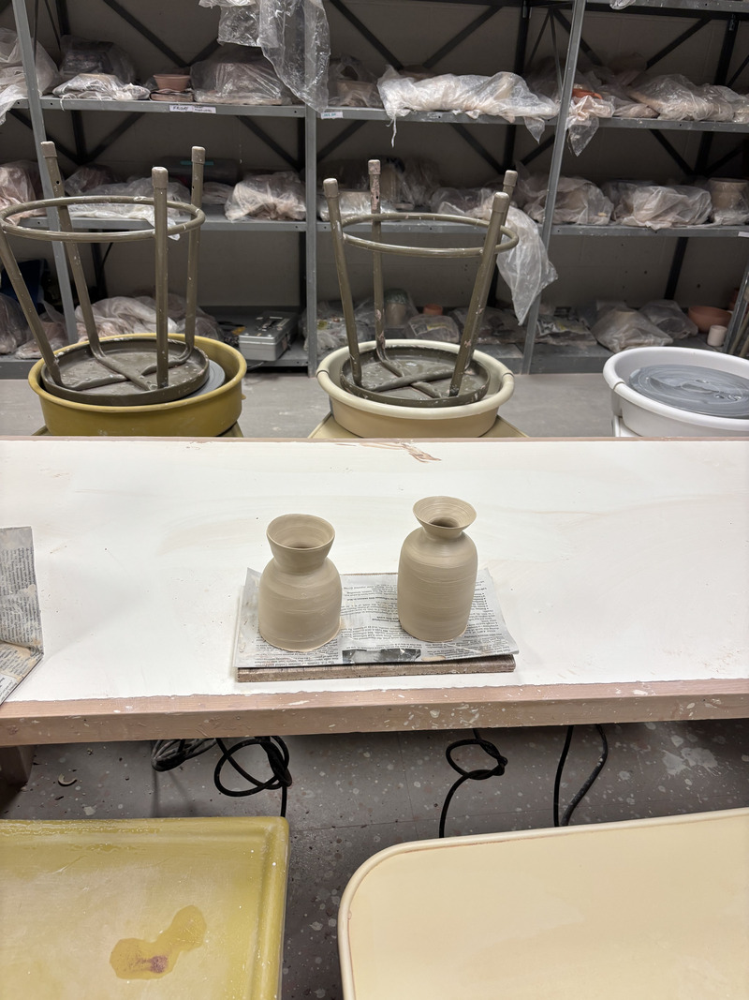
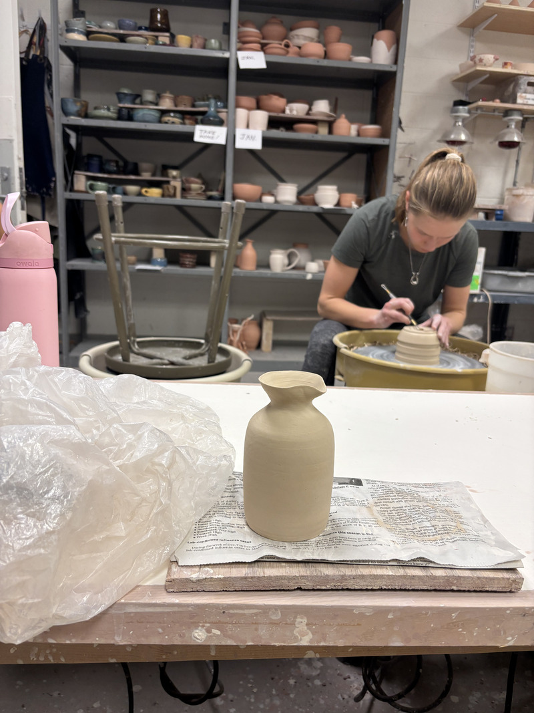
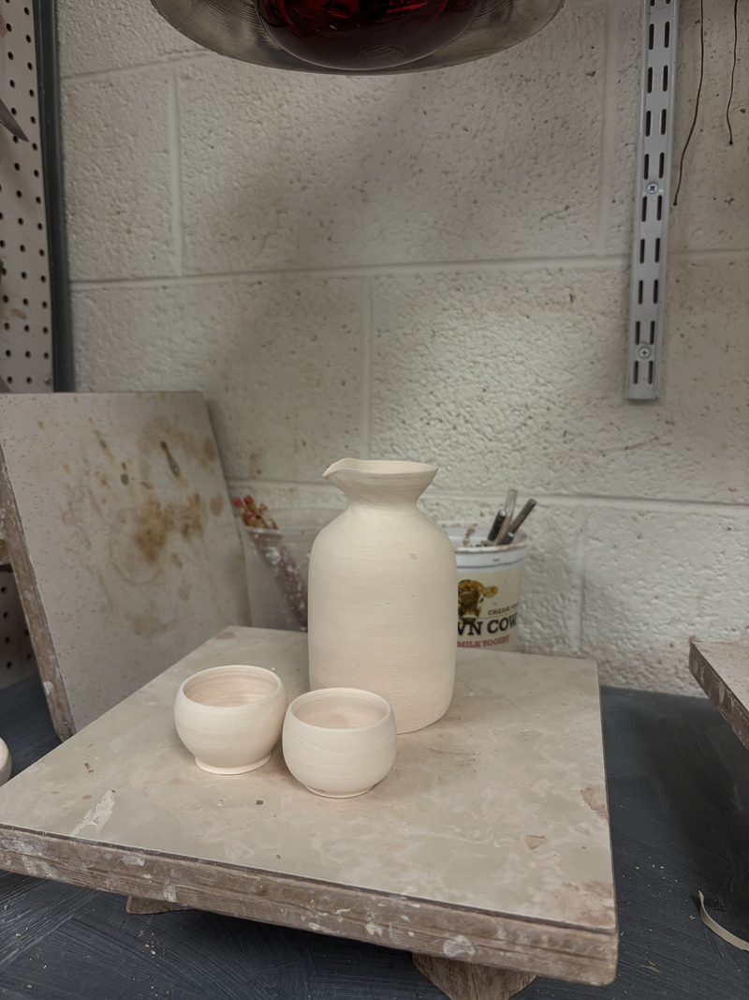
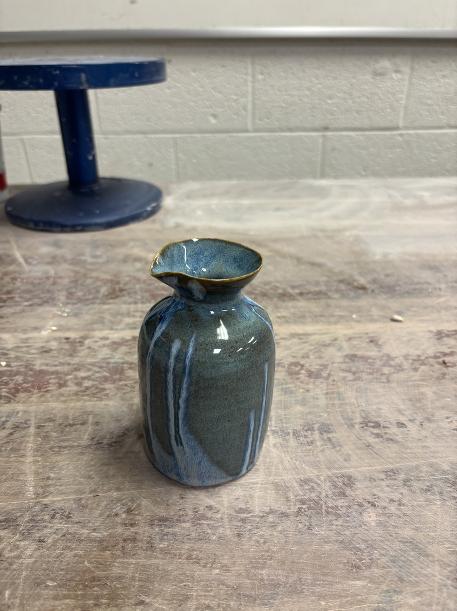
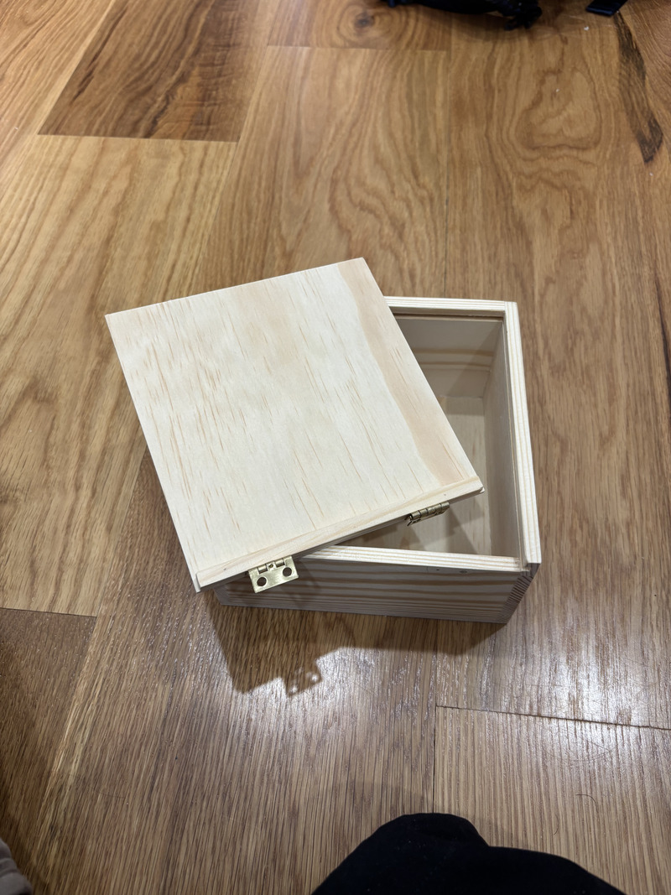
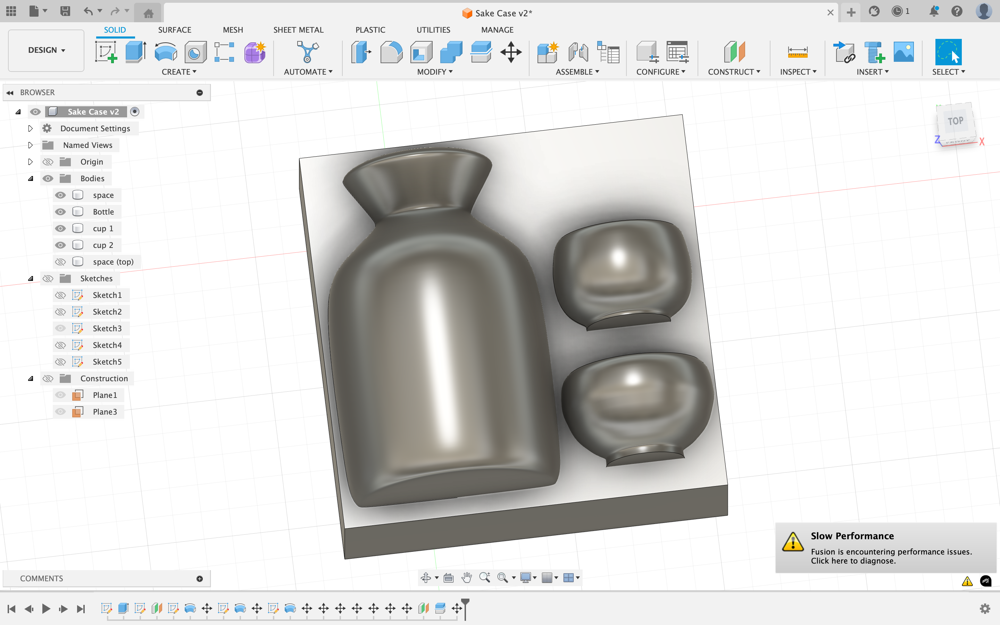
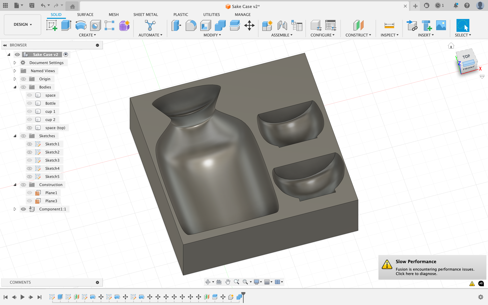
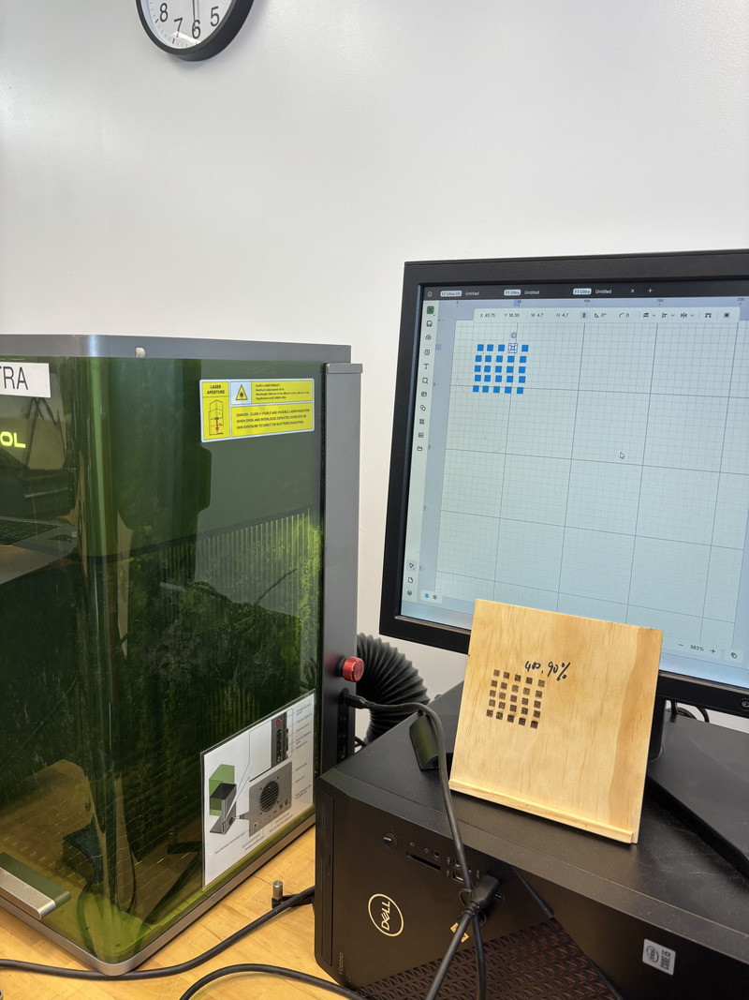
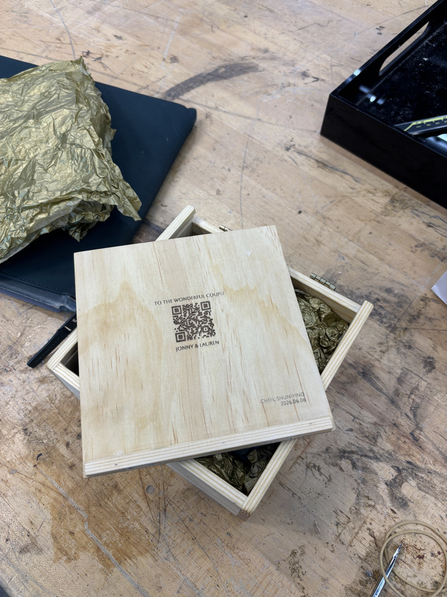

### 1. Intro
Beautiful people are getting married, and I want to make something for them with my recently acquired ceramics skill. As Jonny taught me so much during How To Make, it feels right to document the process here on a secret page of the HTMAA documentation website to make him proud. It is also pretty insane how it has been 80 weeks since then. This document is very long, probably excessively long, and I hope you are a fast reader. All the best wishes Jonny & Lauren! 
(Update: I later realized that our SSH key to push content to the HTMAA git server has expired, which makes sense. Decided to create a random Github account to host this documentation instead! Glad I checked before engraving the QR code to my HTMAA website)

### 2. Wet Clay Day
I had this idea of making a set of something even before I started the ceramics class this semester. I’ve thought about making two pairs of chopsticks, or two sets of plates and bowls, or even two cars, but eventually settled on the idea of a set of sake bottle with two tiny cups. 

I threw the sake bottle first on March 4, since it seems more challenging to me. I made 2 attempts that day, each starting with around 1.5lb of white clay, and preferred the shape of the taller one. I also attempted to throw an even taller one using a stick to reach deep inside and pull up the clay that way, but the new technique was too hard for me and it didn’t work out. So I sticked with this shorter, wider design, which I still think is cute. As for the cups, initially I really wanted to challenge myself to create two identical ones as I have never done that, but it turned out to still be too hard for my current skill level lol. Since these cups are tiny and would be near impossible to center individually, it’s better to first center a huge lump of clay and then pinch out tiny amounts to throw with. This made starting from the same amount of clay challenging, and my gestures are not that consistent anyways, so after a few tiny cups I decided that I’m not ready for identical cups yet. This is the kind of things that I didn’t know is impressive when I started, as larger bowls and taller vases have always caught my eyes more than eight identical humble looking mugs, but now I know. Everyone is unique anyway, and cups should also all have their own characters!

### 3. Trimming
I covered the wet clay in plastic sheets and waited around a week for it to dry until leather hard for trimming. Trimming of the bottle happened on March 11, and it went smoothly though I was pretty stressed. I didn’t change the shape much, just thinning down the wall and smoothing out the edges. Since there’s no room to trim a foot, I sculpted out some of the bottom clay and tapped it inward to create the concave shape that will make it stand more stably after firing. The cups were also lightly trimmed the other day, and for these I made sure to trim out nice feet that define the form of tiny sake cups, which I’m pretty proud of. I started with five cups, but two of them were ruined during the making of the foot, so I’m left with three. In the end, I still managed to find two that look best with each other. After signing off my initials on the bottom, it’s now ready for bisque firing. 

### 4. Glazing
Waiting for your pieces to be fired is always quite stressful. You never know if a crack will appear or worse, if it just explodes. Fortunately, they turned out so nice! Holding the bisque wares and arranging them as a set together made me so happy, and I was very excited to glaze them. Glazing, however, is another pretty stressful procedure. You are never certain how the glazed pieces will turn out, even with all the test tiles that I was referencing. To play it safe, I went with the combination that I have the most experience with, which is rosey dawn (white/pink on its own) on floating blue. The combination creates the color of water that I really like, and it contrasts well with the color of the floating blue itself. To make it clear that the three pieces are a set, I used the same gestures to first dip the lightly dampened piece in floating blue for 4 seconds, let it dry for a minute and then drip rosey dawn from the edge to create this pattern of stripes around it. After another stressful wait for the glaze firing, I was so happy with how it turned out! The cups were glazed and fired much later, and I’m glad that the glaze was consistent enough across time that they still look like the same family. 

### 5. The Case
At this point, the most important part is done and I proudly showed them to Li-Fang, Kye, Allen, and more. It then occurred to me that in order to present it as a wedding gift, they also need a nice casing as well. If I had time, I would have picked the prettiest wood and made a box myself, as I really want to spend more time doing woodworking. I did not have that much time so I bought wooden boxes online and thought that this was a straightforward solution. The dimensions on their website, however, is not accurate and the sliding lid would not fit with the intended orientation. Instead of finding another box, I figured that if I turned the lid upside down and used a hinge to close the lid instead, it could work. So I walked to the very friendly Inman Hardware Store, thinking about how nice Inman Square is with all the nice and useful shops around. I bought some hinges, tiny screws, and sandpaper, drilled tiny holes, littered my room with dust, and had the lid made. 

### 6. The Holding Block
Instead of carving a piece of foam, I thought that since there’s a 3D printer lying around in our house, I might as well CAD the holding block and print it out. How To Make was my very first time opening a CAD software, and although I haven’t used it for any complicated engineering project, the ability to CAD something makes me happy and I would find any excuse to do so. I created the models of my sake bottle and the two cups with images as reference, and carved out a block with them to make the holding block. I iterated three times to adjust the height and the contours with the final version printed on June 3, and everything finally fits in the box. It looks so professional! Now it’s officially a gift. 

### 7. Final Touches
I thought about staining the box, but eventually decided to minimize the risk and just finish it with linseed oil. The box does look better after 3 rounds of thin coating of oil. I also wanted to engrave the QR code to link to this documentation, so I went to the CBA shop and played with F1 Ultra. I did a quick test for power and speed, and decided to go with 90% power at a speed of 400 mm/s. The engraving worked pretty well! Some parts are lighter than others, which is probably due to the uneven coating of oil. In hindsight, I should probably apply the oil after engraving. At least the QR code works. I was doing this on June 5, right before I left for my 4:40 pm flight to SFO actually. As I’m writing this, I’m on the plane, seat 20E to be exact if you’re curious. There’s one thing left, which I almost have time to finish in the shop, but figuring out where to host this page took some unexpected time. The lid needs a latch to hold it in place. I plan to work with whatever materials I have, and I got some weak magnets and repurposed strips of cloth from a cap in the CBA shop, from which I will make a latch tonight in our Airbnb in Sonoma. I hope it works! (Update: turns out the magnet is way too weak, and I improvised something with the strips of fabric themselves)

### Outro
That’s all for the detailed journey of the making of this gift for you two on this wonderful day. I know this is more of a personal journal than a project documentation, but I had a lot of fun making this, so I want to take notes of all the little thoughts along the way. You are both such wonderful, genuine, interesting, and profound people, and you two together is truly inspiring. I am very grateful to be a part of your journey, and I wish you both all the best. Be sure to use the sake bottle set at least once a year! Otherwise, it will wither and cry in the corner. 

### Additional Documentation
Given that I’m making this page, I might as well include the making of that olive picking car as well. That’s also a very fun build.

This was my second time making a car with ceramics, and I made some changes to the process. Last time, I hand-rolled the wheels but was not too satisfied with the roundness of them. This time, I tried throwing a column, and then slice it up once it’s slightly dried. I also threw a tiny bowl as the collection bin. The rest of the parts were assembled from carved pieces out of a slab that I rolled. The wheels turned out to be much rounder than last time, but I still encountered the issue of not being able to stick the axle perpendicular and center to the wheel. Additionally, I should’ve connected the axles of both sides so that they don’t sag toward the center. The rotating base and the socket should also have been cut out from the same piece of clay to fit better. Many issues aside, it’s still the coolest piece that I’ve made and I’m glad I forced my way into the history of Whole Earth Robotics. 

